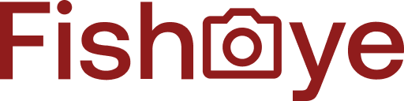

# Fisheye

![html][html5-badge]
![css][css3-badge]
![sass][sass-badge]
![javascript][javascript-badge]
![vscode][vscode-badge]
![w3c][w3c-badge]

## Demo

https://fisheye-vza.netlify.app

## Description

Depuis quelques semaines, vous êtes développeur junior chez Techasite, une société de conseil spécialisée dans le développement de sites web et d'applications mobiles. Avec votre cheffe de projet Amanda et le Designer UI, vous venez de faire une réunion de lancement du projet avec un nouveau client, FishEye.

FishEye est un site web qui permet aux photographes indépendants de présenter leurs meilleurs travaux. Ils ont récemment levé des fonds et aimeraient mettre à jour leur site web. Le designer de Techasite a crée une maquette de la version desktop du nouveau site.

En tant que développeur, vous êtes chargé de la réalisation du prototype du site web à partir de cette maquette. La priorité du client étant l'accessibilité, il faudra veiller à respecter l'ensemble des exigences d'accessibilité définies par Amanda et s'assurer notamment du bon fonctionnement de la navigation du site au moyen du clavier.

## Compétences évaluées

- Gérer les évènements d'un site avec JavaScript
- Assurer l'accessibilité d'un site web
- Ecrire du code JavaScript maintenable
- Développer une application web modulaire avec des design patterns

## Contact
Ghassen HAJLAOUI

[![linkedin][linkedin-badge]][linkedin-url]
[![github][github-badge]][github-url]

<a href="#readme-top">back to top</a>

<!-- BADGE LINKS -->

[html5-badge]: https://img.shields.io/badge/HTML5-E34F26?style=for-the-badge&logo=html5&logoColor=white
[css3-badge]: https://img.shields.io/badge/CSS3-1572B6?style=for-the-badge&logo=css3&logoColor=white
[sass-badge]: https://img.shields.io/badge/Sass-CC6699?style=for-the-badge&logo=sass&logoColor=white
[javascript-badge]: https://img.shields.io/badge/JavaScript-323330?style=for-the-badge&logo=javascript&logoColor=F7DF1E
[vscode-badge]: https://img.shields.io/badge/Made%20with-VSCode-1f425f.svg?style=for-the-badge&logoColor=white
[w3c-badge]: https://img.shields.io/w3c-validation/default?style=for-the-badge&logoColor=white&targetUrl=https%3A%2F%2Ffisheye-vza.netlify.app
[linkedin-badge]: https://img.shields.io/badge/LinkedIn-0077B5?style=for-the-badge&logo=linkedin&logoColor=white
[linkedin-url]: https://www.linkedin.com/in/ghassen-hajlaoui-a7177560
[github-badge]: https://img.shields.io/badge/GitHub-0a0a0a?style=for-the-badge&logo=github&logoColor=white
[github-url]: https://github.com/ghassenhajlaoui
